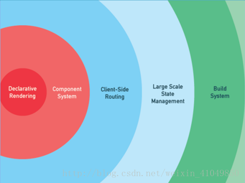
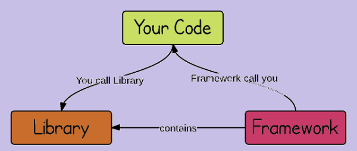
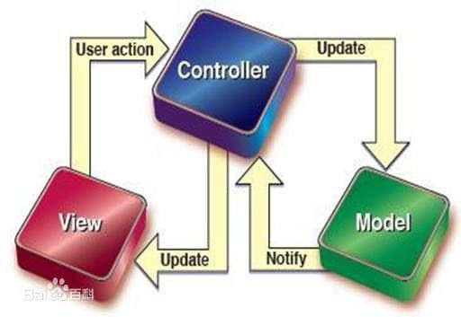

# Vue基本概念


## 课程介绍

- Vue基础知识
- Vue全家桶（vue/vue-router/vuex/axios）
- 组件化开发
- webpack - 前端模块化打包构建工具
- ES6 - [ECMAScript 6 入门](http://es6.ruanyifeng.com/)
- Vue项目

## vue介绍

- [vue 中文网](https://cn.vuejs.org/)
- [Vue.js 是什么](https://cn.vuejs.org/v2/guide/index.html#Vue-js-%E6%98%AF%E4%BB%80%E4%B9%88)
- Vue (读音 /vjuː/，类似于 **view**) 是一套用于构建用户界面的**渐进式框架**。 
- 建议：**通读一遍Vue官网教程中的基础内容**

## 渐进式的概念-尤雨溪

> 渐进式——在原有项目中，可以先尝试引入一两个组件，可以当插件用....甚至也可以用它来开发整个项目！

[vue是一个渐进式的框架，我是这么理解的](http://www.bslxx.com/a/vue/2017/1026/1082.html)

使用vue，不用一来就使用Vue所有的全家桶， 从最初的只因多看你一眼而用了前端js库，一直到最后的大型项目决方案。 




## 库和框架的概念



- [我们所说的前端框架与库的区别？](https://zhuanlan.zhihu.com/p/26078359?group_id=830801800406917120)

### Library

> 库，本质上是一些函数的集合。每次调用函数，实现一个特定的功能

- 代表：jQuery
- 使用库的时候，把库当成工具使用，需要自己控制代码的执行逻辑。

### Framework

> 框架，是一套完整的解决方案，使用框架的时候，需要把你的代码放到框架合适的地方，框架会在合适的时机调用你的代码

- 框架规定了自己的编程方式，是一套完整的解决方案
- 使用框架的时候，由框架控制一切，我们只需要按照规则写代码

### 库和框架的区别

+ 使用库的时候，很自由，只要调用库提供的各种各样的方法就行，也可以不用其他的一些方法
+ 使用框架的时候，需要按照框架的规则写代码，限制会非常多，但同时框架的功能也很强大，可以极大的提升开发的效率。


## MVVM的概念

参考资料：[从Script到Code Blocks、Code Behind到MVC、MVP、MVVM](https://www.cnblogs.com/indream/p/3602348.html)

### MVC

- MVC是一种软件架构模式，也有人叫做设计模式  服务端渲染
- M: Model 数据模型（专门用来操作数据，数据库的CRUD）
- V：View 视图（对于前端来说，就是页面）
- C：Controller 控制器（是视图和数据模型沟通的桥梁，用于处理业务逻辑）




### MVVM

MVVM，一种更好的UI模式解决方案

- M：model数据模型
- V：view视图
- VM：ViewModel 视图模型

- MVVM通过`数据双向绑定`让数据自动地双向同步
  - V（修改视图） -> M（数据自动同步）
  - M（修改数据） -> V（视图自动同步）


### Vue中的MVVM

虽然没有完全遵循 MVVM 模型，Vue 的设计无疑受到了它的启发。因此在文档中经常会使用 vm (ViewModel 的简称) 这个变量名表示 Vue 实例 

注意：

**1. 在vue中，不推荐直接手动操作DOM！！！** 

**2. 在vue中，通过数据驱动视图，不要在想着怎么操作DOM，而是想着如何操作数据！！**

# vue初体验

## 基本使用步骤

- 安装：`npm install vue`
- 注意：开发期间使用未压缩版vue.js！！！重说三

```html
<div id="app">
    <!-- 3.可以通过{{}}显示vue中的数据 -->
    <h1>{{msg}}</h1>
</div>

<!-- 1. 引入vue.js -->
<script src="./node_modules/vue/dist/vue.js"></script>

<script>
    // 2. 创建vue实例，需要指定el和data属性
    let vm = new Vue({
        // 指定vue监管的视图区域,只要id为app的div内部才会受vue的管理
        el: '#app',
        // 提供了vue中使用的数据
        data: {
            msg: 'hello vue'
        }
    })
</script>
```

问题1：把`{{msg}}`写到`div#app`外能生效么？

问题2：el能否写成ele, data能否写成datas? 框架的限制很多，但是习惯就好了！

## 插值表达式

插值表达式：`{{}}`，也叫Mustache语法，小胡子语法，因为长得像胡子

- 解释：使用`{{}}`（插值表达式）从`data`中获取数据，并展示在模板中
- 说明：`{{}}`中只能出现JavaScript表达式
- 说明：数据对象的属性值发生了改变，插值处的内容都会更新

```html
<h1>Hello, {{ msg }}.</h1>
<p>{{ isOk ? 'yes': 'no' }}</p>
<p>{{ 1 + 2 }}</p>

<!-- ！！！错误示范！！！ -->
<h1 title="{{ if(){} }}"></h1>
<h1 title="{{ err }}"></h1>
```

# vue指令

- 解释：指令 (Directives) 是带有 `v-` 前缀的特殊属性，可以在html标签中使用，可以看成特殊的html属性
- 作用：指令提供了一些特殊的功能，当指向绑定到标签上时，可以给标签增加一些特殊的行为

## v-bind指令

- 描述：插值表达式不能用在html的属性上，如果想要动态的设置html元素的属性，需要使用v-bind指令
- 作用：动态的设置html的属性
- 语法：`v-bind:title="msg"`
- 简写：`:title="msg"`

```html
<!-- 完整语法 -->
<a v-bind:href="url"></a>
<!-- 缩写 -->
<a :href="url"></a>
```

## v-model指令

- 作用：在表单元素上创建双向数据绑定
- 说明：监听用户的输入事件以更新数据
- 思考：如何在JS代码中获取到文本框的值？？？

```html
<input type="text" v-model="message" placeholder="edit me">
<p>Message is: {{ message }}</p>
```

### 双向数据绑定

- 双向数据绑定：将DOM与Vue实例的data数据绑定到一起，彼此之间相互影响
  - 数据的改变会引起DOM的改变
  - DOM的改变也会引起数据的变化
- 原理：数据劫持，`Object.defineProperty`中的`get`和`set`方法
  - `getter`和`setter`：访问器
  - 作用：指定`读取或设置`对象属性值的时候，执行的操作
- 注意：`Object.defineProperty`方法是ES5中提供的，IE8浏览器不支持这个方法。因此，Vue支持IE8及其以下版本浏览器
- [Vue - 深入响应式原理](https://cn.vuejs.org/v2/guide/reactivity.html)
- [MDN - Object.defineProperty()](https://developer.mozilla.org/en-US/docs/Web/JavaScript/Reference/Global_Objects/Object/defineProperty)

```js
/*
  语法
*/
var obj = {}
Object.defineProperty(obj, 'msg', {
  // 设置 obj.msg 执行的操作
  set: function () {},
  // 读取 obj.msg 执行的操作
  get: function () {}
})
```

### Vue双向绑定的极简实现

- [剖析Vue原理&实现双向绑定MVVM](https://segmentfault.com/a/1190000006599500)
- [mini版的vue](https://github.com/DMQ/mvvm)

```html
<!-- 示例 -->
<input type="text" id="txt" />
<span id="msgBox"></span>

<script>
const txt = document.getElementById('txt')
const msgBox = document.getElementById('msgBox')
const obj = {}

// 给对象obj添加msg属性，并设置setter访问器
Object.defineProperty(obj, 'msg', {
  // 设置 obj.msg 执行的操作
  set: function (curVal) {
    txt.value = curVal
    msgBox.innerText = curVal
  }
})

// 监听文本框的改变
txt.addEventListener('input', function (event) {
  obj.msg = this.value
})
</script>
```

## v-text指令

- 解释：更新元素的 `textContent`。如果要更新部分的 `textContent` ，需要使用 `{{ Mustache }}` 插值。 

```html
<h1 v-text="msg"></h1>
```

## v-html指令

- 解释：更新DOM对象的 innerHTML,html标签会生效

```html
<h1 v-html="msg"></h1>
```

**在网站上动态渲染任意 HTML 是非常危险的，因为容易导致 [XSS 攻击](https://en.wikipedia.org/wiki/Cross-site_scripting)。只在可信内容上使用 `v-html`，**永不**用在用户提交的内容上。** 

## v-on指令

- 作用：绑定事件
- 语法：`v-on:click="say"` or `v-on:click="say('参数', $event)"`
- 简写：`@click="say"`
- 说明：绑定的事件从`methods`中获取
- 案例：跑马灯

```html
<!-- 完整语法 -->
<a v-on:click="doSomething"></a>
<!-- 缩写 -->
<a @click="doSomething"></a>
```

### 事件修饰符

- `.stop`       阻止冒泡，调用 event.stopPropagation()
- `.prevent`    阻止默认行为，调用 event.preventDefault()
- `.capture`    添加事件侦听器时使用事件`捕获`模式
- `.self`       只当事件在该元素本身（比如不是子元素）触发时，才会触发事件
- `.once`       事件只触发一次

### 按键修饰符

在监听键盘事件时，我们经常需要检查常见的键值。Vue 允许为 `v-on` 在监听键盘事件时添加按键修饰符： 

```js
.enter
.tab
.delete (捕获“删除”和“退格”键)
.esc
.space
.up
.down
.left
.right
```

## v-for

- 作用：基于源数据多次渲染元素或模板块

```html
<!-- 1 基础用法 -->
<div v-for="item in items">
  {{ item.text }}
</div>

<!-- item 为当前项，index 为索引 -->
<p v-for="(item, index) in list">{{item}} -- {{index}}</p>
<!-- item 为值，key 为键，index 为索引 -->
<p v-for="(item, key, index) in obj">{{item}} -- {{key}}</p>
<p v-for="item in 10">{{item}}</p>
```

### key属性

- 推荐：使用 `v-for` 的时候提供 `key` 属性，能够提升列表渲染的性能
- 说明：使用 key，VUE会基于 key 的变化重新排列元素顺序，并且会移除 key 不存在的元素。
- [vue key](https://cn.vuejs.org/v2/guide/list.html#key)
- [vue key属性的说明](https://www.zhihu.com/question/61064119/answer/183717717)

```html
<div v-for="item in items" :key="item.id">
  <!-- 内容 -->
</div>
```

## v-if 和 v-show

- [条件渲染](https://cn.vuejs.org/v2/guide/conditional.html)
- `v-if`：根据表达式的值的真假条件，销毁或重建元素
- `v-show`：根据表达式之真假值，切换元素的 display CSS 属性

```html
<p v-show="isShow">这个元素展示出来了吗？？？</p>
<p v-if="isShow">这个元素，在HTML结构中吗？？？</p>
```

## 样式处理-class和style

- 使用方式：`v-bind:class="expression"` or `:class="expression"`
- 表达式的类型：字符串、数组、对象（重点）
- 语法：

```html
<!-- 1 -->
<!-- 重点 -->
<div v-bind:class="{ active: true }"></div> ===>
<div class="active"></div>

<!-- 2 -->
<div :class="['active', 'text-danger']"></div> ===>
<div class="active text-danger"></div>

<!-- 3 -->
<div v-bind:class="[{ active: true }, errorClass]"></div> ===>
<div class="active text-danger"></div>


--- style ---
<!-- 1 -->
<div v-bind:style="{ color: activeColor, 'font-size': fontSize + 'px' }"></div>
<!-- 2 将多个 样式对象 应用到一个元素上-->
<!-- baseStyles 和 overridingStyles 都是对象 -->
<div v-bind:style="[baseStyles, overridingStyles]"></div>
```

## 提升性能：v-pre

- 说明：跳过这个元素和它的子元素的编译过程。可以用来显示原始 Mustache 标签。跳过大量没有指令的节点会加快编译。

```html
<span v-pre>{{ this will not be compiled }}</span>
```

## 提升性能：v-once

- 说明：只渲染元素和组件一次。随后的重新渲染，元素/组件及其所有的子节点将被视为静态内容并跳过。这可以用于优化更新性能。

```html
<span v-once>This will never change: {{msg}}</span>
```

## 案例：品牌管理
