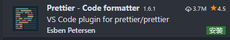

# Prettier插件使用

> Prettier是一个很有特色的代码格式化工具，它可以使整个代码库的格式化过程自动化。

## 安装



## 配置

```json
"editor.formatOnSave": true, //保存的时候自动格式化 
"prettier.semi": false,      //保存的时候自动去除分号
"prettier.singleQuote": true,//字符串中使用单引号
```


## prettier插件与eslint冲突

在`eslintrc`文件中配置

```js
// 关闭eslint的这个错误校验
'space-before-function-paren': 0
```

# 两种构建版本的解释

+ runtime版本

```js
没有template选项，只能使用render
```

+ runtime+template版本

```js
有template选项
```

# 状态保持-cookie+session

http是无状态的

```js
1. 最早的时候，web的作用就是网页的浏览器。  服务器只用提供简单的网页浏览器操作即可，不用记住刚刚谁发了请求，更没有登录，注册之类的操作
2. http设计之初就是无状态的
3. http无状态： http不会记住每一次的请求   就跟公交车司机不会记住乘客一样
4. 这段时间很嗨皮，业务逻辑非常简单。
```

如何实现状态保持？（cookie+session）

```js
1. 随着交互型的网页的兴起，在线购物网站，需要登录的网站变得越来越多。但是http是无状态的
2. 通过cookie + session实现状态保持
3. 服务端在用户登录的时候，给分配一个session用于存储数据，同时将sessionID返回给浏览器
4. 浏览器通过cookie把sessionID存储起来，下次访问时携带上
5. 服务端就可以通过sessionID来确定用户是否登录  【喝咖啡的例子】
```

cookie+session的缺点

```js
1. 通过cookie+sesion技术实现了状态的保持，大家都很嗨皮
2. 服务端不嗨皮了，原因如下：
	- 每个人登录都需要在服务端开辟一块空间来存储用户的信息，如果访问的人越来越多了，该怎么办？
	- 浪费了大量的内存，对于服务器来说是一个很大的开销。
	- 手机端很多浏览器不支持cookie或者是禁用cookie
```

集群+负载均衡

```jsx
1. 因为需要访问的用户越来越多，一台服务器扛不住压力了
2. 那就准备2台，3台，甚至是更多的服务器进行服务
3. 问题：如果小明的请求第一次访问了A服务器，下一次访问了B服务器怎么办？
4. 使用缓存（redis/Memcached）,将所有的session存储到数据库中，所有的session都统一去数据库中进行查找
5. 服务端也嗨皮了，但是数据库服务器崩了咋办？？？
```


总结：cookie+session的缺点

- 服务器需要存储session，浪费空间
- 如果用户数量过多，无法集群，需要session共享或者是session持久化
- 手机端很多浏览器不支持cookie或者是禁用cookie
- cookie无法跨域，不能跨站点登录 

# 状态保持-token

> token: 令牌，票据

- token机制

```js
1. 想想，我为什么要存储session呢，浪费我大量的内存，要是不存该有多好啊，但是不存储session，我怎么验证合法用户？ 关键点就在于验证   服务端不存储任何的数据，我还能验证你的真实身份

2. 当小明登录系统的时候， 根据小明的用户名生成一个token(令牌)，把令牌交给小明，服务端不做任何存储。下次小明登录时，小明带上token进行访问，服务端对token进行校验
3. 校验token比存储session省事多了
```

'

- token的优势

```
1. token无状态，服务端不用存储token，服务端只需要签发和校验token即可。
2. 集群：token是无状态，集群的时候，算法一致，无论访问哪台服务器，都是一样的
3. 性能： 解析token效率比查询数据库高的多
4. 跨站点：只要服务端算法一致，token就可以夸站点登录
5. 移动端：在移动端开发中，使用cookie非常麻烦，使用token验证非常常见
```


# 导航守卫配合token实现登录拦截

需求： 在每一次路由跳转的时候，判断用户是否登录

- 判断是否存在token，localStorage.getItem()
- 如果有，让你继续即可
- 如果没有，返回登录组件

[vue-router导航守卫](https://router.vuejs.org/zh/guide/advanced/navigation-guards.html)

```js
// 注册导航守卫
// 参数1： to:到哪儿去
// 参数2： from:从哪儿来
// 参数3： next:正常放行
router.beforeEach((to, from, next) => {
  let token = localStorage.getItem('myToken')
  // 如果访问的是登录页，不需要判断
  if (to.path === '/login') {
    next()
    return
  }
  if (token) {
    next()
  } else {
    // 去登录页面
    next('/login')
  }
})
```


1. 在登录成功的时候，需要把服务端颁发的token存储起来，localStorage中
2. 使用导航守卫来判断用户的登录状态  [导航守卫](https://router.vuejs.org/zh/guide/advanced/navigation-guards.html#%E5%85%A8%E5%B1%80%E5%AE%88%E5%8D%AB)

```js
登录状态的思路

如果浏览器中能够获取到token，说明用户登录过
如果浏览器中没有token，说明没有登录
```

1. 导航守卫如何使用

```js
1. 在router/index.js中

//to: 去哪儿
//from: 从哪儿来
// next: 放行   next('/login')
router.beforeEach( (to, from, next)=>{
 	let token = 获取token
    if (token) {
        next()
    } else {
      next('/login')  
    }
})

```

- 登录页会不停的跳，守卫在拦截登录页

```js
//to: 去哪儿
//from: 从哪儿来
// next: 放行   next('/login')
router.beforeEach( (to, from, next)=>{
 	let token = 获取token
    if (to.path === '/login') {
        next()
        return
    }
    if (token) {
        next()
    } else {
      next('/login')  
    }
})

```


- 天坑

在登录成功的时候，需要先存储token，才能跳转，不然会导航守卫给拦截


# Home组件-头部布局


# Home组件-退出功能

- 思路

```js
1. 给退出注册一个点击事件
2. 弹出一个对话框（模态框）
3. 如果用户点击确定，退出系统
4. 只需要把本地的token清除，跳转到登录组件
```

- 注册点击事件

```html
<a href="javascript:;" @click="logout">退出</a>
```

- 提供logout方法

```js
  methods: {
    logout () {

    }
  }
```

- 退出功能的代码 [messagebox](http://element-cn.eleme.io/#/zh-CN/component/message-box)

```js
methods: {
    logout () {
        this.$confirm('你确定要退出系统吗?', '温馨提示', {
            confirmButtonText: '确定',
            cancelButtonText: '取消',
            type: 'warning'
        }).then(() => {
            // 1. 删除localStorage中的myToken
            localStorage.removeItem('myToken')
            // 2. 跳转到登录组件
            this.$router.push('login')
            // 3. 给一个退出的提示
            this.$message.success('退出成功了')
        }).catch(() => {
            this.$message({
                type: 'info',
                message: '退出取消了'
            })
        })
    }
}
```

# Home组件-侧边栏导航功能

思路

```js
1. 根据elementui把组件引进来
2. 根据项目的需求改吧改吧
```

- [NavMenu 导航菜单](http://element-cn.eleme.io/#/zh-CN/component/menu)

# Home组件-创建一个Users组件

子组件的思路

```
router/index.js 中配置children
在home.vue中配置router-view
```

# Users组件-表格布局

- 分析表格的结构
- 获取用户的数据

# Users组件-数据渲染

# Users组件自定义列模版

# Users组件-分页功能

# Users组件-搜索功能

# Users组件-启用与禁用功能