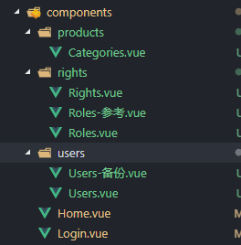

# 左侧菜单动态显示

+ 获取到左侧的菜单数据

```js
async created() {
    // 获取菜单的列表
    let res = await this.axios.get('menus')
    let { meta: { status }, data } = res.data
    if (status === 200) {
        this.menuList = data
        console.log(this.menuList)
    }
}
```

+ 在data中提供menuList数据

```js
data() {
    return {
        menuList: []
    }
},
```

+ 把菜单数据显示到页面中

```html
<el-menu
         default-active="1-1"
         @open="handleOpen"
         @close="handleClose"
         background-color="#545c64"
         text-color="#fff"
         active-text-color="#ffd04b"
         unique-opened
         router>
    <!-- 一个el-submenu对应了一条数据 -->
    <el-submenu v-for="menu in menuList" :key="menu.id" index="1">
        <template slot="title">
            <i class="el-icon-location"></i>
            <span>{{menu.authName}}</span>
        </template>
        <el-menu-item v-for="item in menu.children" :key="item.id" index="/users">
            <i class="el-icon-menu"></i>
            <span slot="title">{{item.authName}}</span>
        </el-menu-item>
    </el-submenu>
</el-menu>
```

+ **问题：菜单的index是一样的，一起显示和一起隐藏**

```html
<el-submenu v-for="menu in menuList" :key="menu.id" :index="menu.path">
    <el-menu-item v-for="item in menu.children" :key="item.id" :index="item.path">
    </el-menu-item>
</el-submenu>
```

+ 每次展开和关闭菜单，控制台都有打印的信息

```html
// 需要删除
@open="handleOpen"
@close="handleClose"
```


# 处理左侧菜单的高亮问题

+ 想要处理高亮问题，需要设置`default-active`

+ 问题：如何获取地址阆中的`rights`和`users`

+ `$route`对象

```js
// 可以获取到当前路由的一些信息
this.$route.path   当前路由的路径
this.$route.query  当前路由的参数

// 注意区分 $route 与 $router
$route:  当前一条路径
$router: 表示项目中整个路由的对象， 跳转路由
```

+ 处理当前路由高亮问题

```js
// 注意： 冒号不能丢
// 注意： 需要去除第一个/
:default-active="$route.path.slice(1)"
```


# 切换用户登录时，token的问题

+ 给axios设置baseURL以及token

```js
//1. 通过axios的拦截器来设置
axios.interceptors.request.use(
  function(config) {
    // 给config配置baseURL
    config.baseURL = 'http://localhost:8888/api/private/v1/'
    // 给config设置headers
    config.headers.Authorization = localStorage.getItem('token')
    return config
  },
  function(error) {
    // 对请求错误做些什么
    return Promise.reject(error)
  }
)

//2. 通过给axios设置默认值来设置
axios.defaults.baseURL = 'http://localhost:8888/api/private/v1/'
axios.defaults.headers.common['Authorization'] = localStorage.getItem('token')

```

+ **注意：产生了一个bug，切换用户的时候，发现菜单没有改变**

```js
// 1.token设置的默认值，无论怎么去切换用户，拿到的token都是默认值
// 2. 每次axios请求获取到的都应该是最新的token值

// 不使用axios的默认配置，使用axios的拦截器来完成baseURL与token的设置
axios.interceptors.request.use(
  function(config) {
    // 给config配置baseURL
    config.baseURL = 'http://localhost:8888/api/private/v1/'
    // 给config设置headers
    config.headers.Authorization = localStorage.getItem('token')
    return config
  },
  function(error) {
    // 对请求错误做些什么
    return Promise.reject(error)
  }
)
```


# 商品分类-创建组件

+ 新建了一个`Categories.vue`组件

```html
<template>
  <div>
    分类参数
  </div>
</template>

<script>
export default {}
</script>

<style>
</style>

```

+ 发现问题：**我们所有的组件全部都扔在conponents文件夹下面，组件越来越多，导致将来难以维护**

```
根据一级权限分了不同的文件夹
```



+ 发现问题：**修改了组件的位置，所以路径也需要修改**

修改router/index.js文件

```js
// 导入Login.vue组件
import Login from '@/components/Login'
// 导入Home.vue组件
import Home from '@/components/Home'
// 导入Users.vue组件
import Users from '@/components/users/Users'
// 导入Rights.vue组件
import Rights from '@/components/rights/Rights'
// 导入Roles.vue组件
import Roles from '@/components/rights/Roles'
// 导入Categories.vue组件
import Categories from '@/components/products/Categories'
```

# 商品分类-列表渲染

+ 获取到列表的数据,在`data`中提供一些数据

```js
data() {
    return {
      categoryList: [],
      current: 1,
      pageSize: 10
    }
  },
```

+ 在`methods`中提供了一个方法，用于获取列表数据

```js
methods: {
    async getCategoryList() {
        let res = await this.axios.get('categories', {
            params: {
                type: 3, // 表示获取3层数据
                pagenum: this.current,
                pagesize: this.pageSize
            }
        })
        let { meta: { status }, data: { result } } = res.data
        if (status === 200) {
            this.categoryList = result
            console.log(this.categoryList)
        }
    }
},
```

+ 在`created`钩子函数中，获取数据

```js
  created() {
    // 获取列表的数据
    this.getCategoryList()
  }
```

+ 把数据显示到表格中

```html
<el-table :data="categoryList" style="width:100%;">
    <el-table-column label="分类名称" prop="cat_name"></el-table-column>
    <el-table-column label="是否删除" prop="cat_deleted">
        <template slot-scope="scope">
            {{scope.row.cat_deleted?'是':'否'}}
        </template>
    </el-table-column>
    <el-table-column label="排序" prop="cat_level"></el-table-column>
    <el-table-column label="操作">
        <template slot-scope="scope">
            <el-button type="primary" icon="el-icon-edit" plain size="small"></el-button>
            <el-button type="danger" icon="el-icon-delete" plain size="small"></el-button>
        </template>
    </el-table-column>
</el-table>
```


# 商品分类-分页功能

你们说的，不用写


# 商品分类-loading状态

+ **在elementui官网找组件 [http://element-cn.eleme.io/#/zh-CN/component/loading](http://element-cn.eleme.io/#/zh-CN/component/loading)**

+ 给el-table组件加上v-loading指令

```html
v-loading="loading"
element-loading-text="亲，等会，玩命加载中"
element-loading-spinner="el-icon-loading"
```

+ 提供一个数据`loading`

```js
data() {
    return {
        categoryList: [],
        current: 1,
        pageSize: 10,
        total: 0,
        loading: true
    }
},
```

+ 思路：每次发送axios请求的前面，v-loading为true，结束请求的时候，让v-loading为false

```js
// 把loading加载状态清除即可
setTimeout(() => {
    this.loading = false
}, 500)
```


# 商品分类-分类的展开功能

+ [github地址](https://github.com/foolishchow/element-tree-grid)

+ 安装

```bash
npm install element-tree-grid
```

+ 注册组件

```js
// 没有使用全局的
var ElTreeGrid = require('element-tree-grid');
Vue.component(ElTreeGrid.name,ElTreeGrid);

// 注册为局部组件
components: {
    // 把ElTreeGrid注册为局部的组件
    'el-table-tree-column': ElTreeGrid
}
```

+ 把`el-table-tree-column`替换原来的`el-table-column`

```html
<el-table-tree-column label="分类名称" prop="cat_name">
</el-table-tree-column>
```

+ 给`el-table-tree-column`指定一些属性   

```html
<!-- tree-key: 指定每一个节点的key，只有指定了才能，嵌套解析 -->
<!-- level-key: 指定层级 -->
<!--  parent-key: 如果不指定，没办法缩起来 -->
<!-- indent-size:指定缩进 -->
<!-- child-key: 通过哪个属性去查找子节点 children -->
<el-table-tree-column 
                      label="分类名称"
                      prop="cat_name"
                      tree-key="cat_id"
                      level-key="cat_level"
                      parent-key="cat_pid"
                      child-key="children"
                      indent-size="20">
</el-table-tree-column>
```


# 商品分类-添加分类

+ 给添加按钮注册点击事件

```html
<el-button type="success" plain @click="showAddDialog">添加分类</el-button>
```

+ 准备对话框

```html
<el-dialog
      title="添加商品分类"
      :visible.sync="addDialogVisible"
      width="40%">
      <!-- 表单 -->
      <el-form ref="addForm" :model="addForm" label-width="80px" :rules="rules" status-icon>
        <el-form-item label="分类名称" prop="cat_name">
          <el-input v-model="addForm.cat_name"></el-input>
        </el-form-item>

      </el-form>
      <span slot="footer" class="dialog-footer">
        <el-button @click="addDialogVisible = false">取 消</el-button>
        <el-button type="primary">确 定</el-button>
      </span>
    </el-dialog>
```

+ 准备方法，显示对话框

```js
// 在data中准备对应的数据
// addForm  addDialogVisiable  rules
async showAddDialog() {
    this.addDialogVisible = true
}
```


+ 需要一个组件，能够选择分类： [级联选择器](https://element.eleme.io/#/zh-CN/component/cascader)

```html
//选择即改变
<el-cascader
  :options="options"
  change-on-select
></el-cascader>
```

+ 准备数据 options数据 

```js
//1. data中定义options数据

// 2. 在showAddDialog中获取到分类的数据(2层)
// 发送ajax请求，获取分类的属性（1级和2级）
let res = await this.axios.get('categories?type=2')
let { meta: { status }, data } = res.data
if (status === 200) {
    this.options = data
    console.log(this.options)
}
```

+ 我们发现，数据拿到了，但是显示不出来

```js
原因：因为我们返回的数据的格式与级联选择器需要的数据格式不一样
// 需要配置 :prop = 'props'

 <el-cascader
    clearable
    :options="options"
    change-on-select
    :props="props"
></el-cascader>

提供一个props
props: {
    value: 'cat_id',
    label: 'cat_name',
    children: 'children'
}
```

