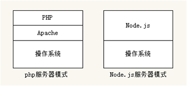

# 大纲-day03

## Web开发概述
- Node.js服务器模型与php服务器模型的区别

## Node.js实现静态网站功能
- 使用http模块初步实现服务器功能
- 实现静态服务器功能

## 参数传递与获取
- get参数获取
- post参数获取

## 动态网站开发
- 创建服务器实现动态网站效果

## 模板引擎
- 理解模板引擎本质
- 引擎基本使用

## Express基本使用
- 静态服务器
- 路由
- 中间件
- 模板引擎整合
- 常用API基本使用

