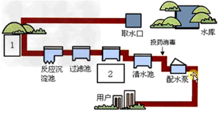

# 大纲-day04
## Express基本使用
- 中间件
- 参数处理
- 模板引擎整合

## Express图书管理案例

## Node.js操作数据库
- Mysql环境准备

## mysql第三方包基本使用
- 操作数据库基本步骤
- 实现增删改成基本操作

## 基于数据库实现登录功能

## Express整合数据库实现增删改查业务

## 后台API开发
- 基于数据库的json接口开发
- 基于数据库的jsonp接口开发

