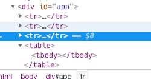

#Note
计算属性：
```javascript
var vm = new Vue({
            el: "#app",
            data: {
                firstName: "Dell",
                lastName: "Lee",
                age: 27,
                // fullName: firstName + " " + lastName,
                fullName: "dell lee",
            },
            watch: {
                // 这个也可以实现缓存，但是没有computed好用简洁
                firstName: function(){
                    console.log("计算了一次");
                    this.fullName = this.firstName + " " + this.lastName;
                },
                lastName: function(){
                    console.log("计算了一次");
                    this.fullName = this.firstName + " " + this.lastName;
                }
            }

            // methods: {
            //     fullName: function(){
            //         // 方法修改的无关这个fullName属性的时候，也会被调用计算，所以无缓存，不好。
            //         console.log("计算了一次");
            //         return this.firstName + " " + this.lastName;
            //     },
            // }

            // computed: {
            //     fullName: function(){
            //         // 如果firstName和lastName没有被修改，那么是不会在进入这个方法的。有个缓存的机制
            //         console.log("计算了一次");
            //         return this.firstName + " " + this.lastName;
            //     }
            // },
```

数据源中的list要么通过引用修改值，要么通过splice shift unshift push这些方法来修改，不能通过list[i]这种下标值来修改。还有一种是Vue.set <=> vm.$set


```javascript
<!-- 如果往里面加属性address怎么加？ 通过引用的方式让它指向一个代用address的userInfo对象 
     另外 通过set  Vue.set(vm.userInfo, 'address', 'beijing'); <==> vm.$set(vm.userInfo, 'address', 'beijing');-->
    <div id="app" >
        <div v-for="(item, key, index) of userInfo" >
            {{ item }} --- {{key}} --- {{index}}
        </div>
        
    </div>
    <script>
        var vm = new Vue({
            el: "#app", 
            data: {
                userInfo: {
                    id:101, 
                    name: 'zs', 
                    age: 20, 
                    sal: 2200,
                },
            }
        });
    </script>
```

## Chapter4
### is属性
使用is解决标签上的一些小bug

如图，row自定义的模板tr跟table同级了。

```JavaScript
<div id="app">
        <table>
            <tbody>
                <tr is="row"></t>
                <row></row>
                <row></row>
            </tbody>
        </table>
    </div>
    <script>
        Vue.component('row', {
            template: "<tr><td>1</tr></td>",
        });
        var vm = new Vue({
            el: '#app',
        });
    </script>
```

改成
```javascript
<tr is="row"></tr>
```     

同理： ul下 select下 ol下都要这样

### 子组件data
在子组件中定义data必须是个函数

### ref的使用
详见chapter4下的Counter.html文件

